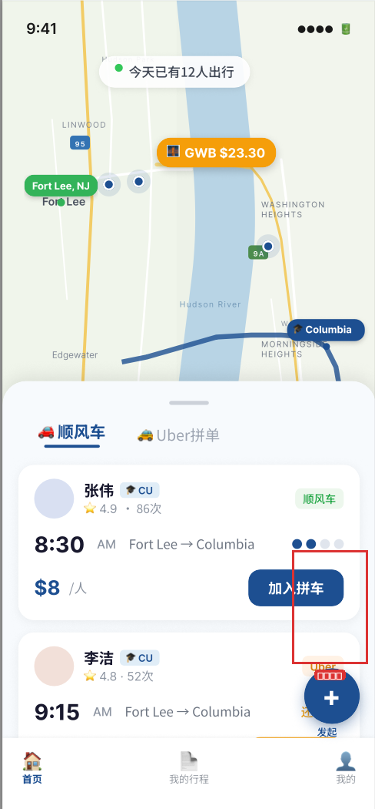
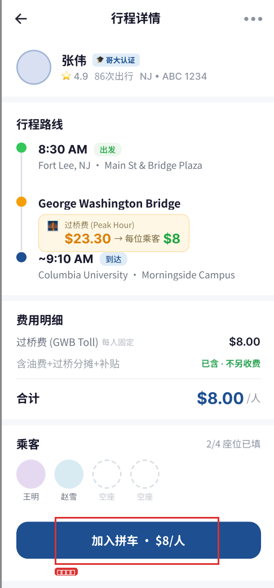
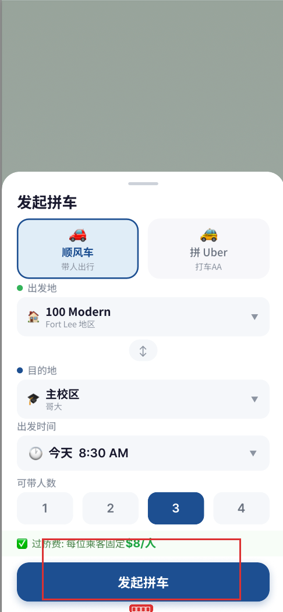
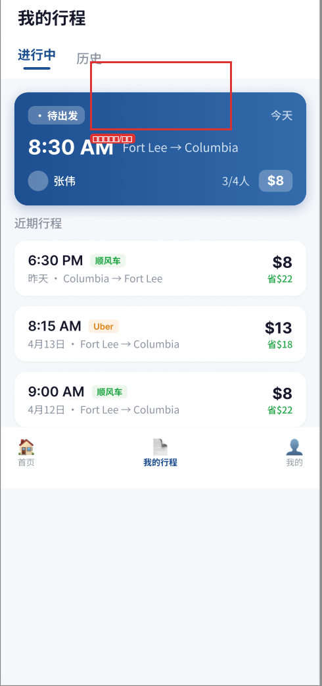
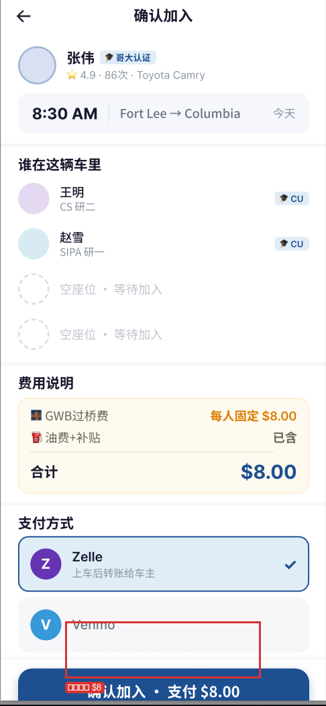

# 🚗 Columbia Carpool Miniapp

<div align="center">


[](https://github.com/KaichenCurry/columbia-carpool-miniapp/stargazers)
[](LICENSE)
[](https://developers.weixin.qq.com/miniprogram/dev/index.html)

**面向哥大留学生的拼车小程序 — Fort Lee ↔ Columbia University**

[English](./README_en.md) · [产品文档](./docs) · [Figma 设计稿](./docs_FIGMA.md)

</div>

---

## 📖 目录

- [项目介绍](#项目介绍)
- [问题与解决方案](#问题与解决方案)
- [功能预览](#功能预览)
- [核心功能详解](#核心功能详解)
- [技术架构](#技术架构)
- [AI 功能](#ai-功能)
- [快速开始](#快速开始)
- [项目结构](#项目结构)
- [未来路线图](#未来路线图)
- [相关链接](#相关链接)

---

## 项目介绍

哥伦比亚大学留学生通勤拼车小程序，连接 **Fort Lee, NJ** 与 **Columbia University**，解决日常通勤中的核心痛点。

### 两种拼车模式

| 模式 | 说明 |
|------|------|
| 🚗 顺风车 | 车主发布行程，乘客加入 |
| 🚕 Uber 拼单 | 乘客组队拼车，分摊车费 |

---

## 问题与解决方案

```
┌─────────────────────────────────────────────────────────────┐
│                        通勤三大痛点                            │
├─────────────────────────────────────────────────────────────┤
│                                                              │
│  💰 过桥费高              📱 协调效率低            🔒 信任难建立    │
│  GWB 单程 $23.30          微信群刷屏找拼车         第一次拼车谁都不信谁 │
│       ↓                         ↓                       ↓      │
│  💵 多人分摊                📋 标准化流程            ✅ 哥大认证体系    │
│  每人仅需 $8               一键发布/加入            身份核实有保障      │
│                                                              │
└─────────────────────────────────────────────────────────────┘
```

---

## 功能预览

### 1. 首页 — 拼车广场



地图展示 Fort Lee ↔ Columbia 路线，实时显示今日拼车人数。

### 2. 行程详情



车主认证信息、路线时间轴、费用明细、乘客列表。

### 3. 发起拼车



选择模式、设置路线和时间、一键发布行程。

### 4. 我的行程



查看进行中/历史的行程，管理已加入的拼车。

### 5. 确认加入



确认行程、选择支付方式（Zelle/Venmo）、完成加入。

---

## 核心功能详解

### 🛡️ 信任体系

| 功能 | 说明 |
|------|------|
| 哥大认证 | 车主必须通过 Columbia 身份认证 |
| 评分系统 | 5 星评分 + 历史行程次数 |
| 实名车辆 | 真实姓名、车牌号、车型信息 |

### 💰 费用透明

| 项目 | 金额 |
|------|------|
| GWB 过桥费 | 固定 **$8/人** |
| 油费补贴 | 已包含 |
| 隐藏费用 | 无 |

### 📱 产品流程

```
浏览行程 → 查看详情 → 加入拼车 → 确认支付 → 我的行程
```

---

## 技术架构

### 系统架构图

```
┌─────────────────────────────────────────────────────────────────┐
│                      微信小程序前端                               │
│   pages/index       pages/trip-detail       pages/my-trips        │
│   components/*      services/*             app.js               │
└─────────────────────────────────────────────────────────────────┘
                              │
                              ▼
┌─────────────────────────────────────────────────────────────────┐
│                    微信云开发云函数                               │
│                                                                  │
│   ┌─────────────┐  ┌─────────────┐  ┌─────────────────────┐    │
│   │ createTrip  │  │  joinTrip   │  │ getCreateTripHint   │    │
│   │ 创建行程     │  │  加入行程    │  │ AI 出发时间建议     │    │
│   └─────────────┘  └─────────────┘  └─────────────────────┘    │
│                                                                  │
│   ┌─────────────┐  ┌─────────────┐  ┌─────────────────────┐    │
│   │  getTrips   │  │getTripDetail│  │      verifyCU       │    │
│   │  获取列表    │  │  行程详情    │  │    哥大认证         │    │
│   └─────────────┘  └─────────────┘  └─────────────────────┘    │
└─────────────────────────────────────────────────────────────────┘
                              │
                              ▼
┌─────────────────────────────────────────────────────────────────┐
│                    微信云开发数据库                              │
│                                                                  │
│      users              trips            passengers              │
│   用户信息              行程数据           乘客关系               │
└─────────────────────────────────────────────────────────────────┘
```

### 技术栈

| 层级 | 技术 | 说明 |
|------|------|------|
| 前端 | 微信小程序 | 原生组件 + 自定义组件 |
| 后端 | 微信云函数 | Node.js 云函数 |
| 数据库 | 微信云数据库 | NoSQL 集合 |
| 地图 | 微信地图 API | 路线展示 |

---

## AI 功能

### 智能出发时间建议

根据历史出行数据，AI 推荐最佳出发时间，帮助用户避开早高峰。

```json
{
  "departureTime": "8:30 AM",
  "confidence": "高",
  "reason": "根据历史数据分析，8:30 AM 出发可避开 GWB 早高峰",
  "strategy": "heuristic_v1"
}
```

**功能特点**：
- 一键应用建议时间到表单
- 切换路线/模式时自动刷新
- 可解释的建议理由

> 注：当前为启发式算法（heuristic），未来计划升级为机器学习模型。

---

## 快速开始

### 环境要求

- 微信开发者工具
- 微信云开发环境

### 部署步骤

```bash
# 1. 克隆项目
git clone https://github.com/KaichenCurry/columbia-carpool-miniapp.git
cd columbia-carpool-miniapp

# 2. 导入项目
# 打开微信开发者工具
# 选择「导入项目」，路径选择 project.config.json 所在目录

# 3. 配置云环境
# 在 miniprogram/app.js 中设置您的云环境 ID

# 4. 初始化数据库
# 在微信云控制台创建集合：users, trips, passengers
# 导入种子数据（可选）：
cloudfunctions/seeds/
├── users.seed.json   # 用户种子数据
└── trips.seed.json  # 行程种子数据
```

### 目录结构

```
columbia-carpool-miniapp/
├── miniprogram/                 # 小程序前端
│   ├── pages/
│   │   ├── index/             # 首页（拼车广场）
│   │   ├── trip-detail/       # 行程详情
│   │   ├── create-trip/       # 发起拼车
│   │   ├── my-trips/          # 我的行程
│   │   └── join-confirm/      # 确认加入
│   ├── components/            # 复用组件
│   ├── services/              # API 服务层
│   └── app.js                # 应用入口
│
├── cloudfunctions/            # 云函数
│   ├── createTrip/           # 创建行程
│   ├── joinTrip/             # 加入行程
│   ├── leaveTrip/            # 退出行程
│   ├── cancelTrip/           # 取消行程
│   ├── getTrips/             # 获取行程列表
│   ├── getTripDetail/        # 行程详情
│   ├── getMyTrips/           # 我的行程
│   ├── getUserProfile/       # 用户信息
│   ├── verifyCU/             # 哥大认证
│   ├── getCreateTripHint/    # AI 出发时间建议
│   └── seeds/               # 种子数据
│
└── docs/
    └── screenshots/          # 功能截图
```

---

## 项目状态

### 已实现 ✅

| 功能 | 状态 |
|------|------|
| 5 页小程序界面 | ✅ |
| 拼车创建和加入流程 | ✅ |
| 行程详情和我的行程 | ✅ |
| 云函数完整骨架 | ✅ |
| 本地 Mock 数据 | ✅ |
| 哥大认证体系 | ✅ |
| AI 出发时间建议 | ✅ |

### 开发中 ⚠️

| 功能 | 状态 |
|------|------|
| 完整支付集成 | ⚠️ 规划中 |
| 实时行程追踪 | ⚠️ 规划中 |
| 机器学习推荐 | ⚠️ 规划中 |

---

## 未来路线图

```
v1.0 (当前) ──────────────────────────────────────────────────────
    ✅ 基础拼车流程
    ✅ 哥大认证
    ✅ AI 启发式建议

        ▼
v1.1 ────────────────────────────────────────────────────────────
    📝 自然语言创建行程
    🔍 智能搜索和筛选

        ▼
v1.2 ────────────────────────────────────────────────────────────
    📊 历史数据分析
    🚗 常用路线收藏

        ▼
v2.0 ────────────────────────────────────────────────────────────
    🤖 机器学习推荐模型
    🚨 GWB 实时路况
    ⚠️ 异常检测和预警
```

---

## 相关链接

| 资源 | 链接 |
|------|------|
| GitHub | https://github.com/KaichenCurry/columbia-carpool-miniapp |
| Figma 设计稿 | [点击访问](https://www.figma.com/design/NHrWvqG4BzihpYZu9Y0Ugg/拼车-UI) |
| 产品需求文档 | [CLAUDE_CODE_PROMPT.md](./CLAUDE_CODE_PROMPT.md) |
| UI 组件规范 | [UI_COMPONENTS.md](./UI_COMPONENTS.md) |

---

## 参与贡献

欢迎提交 Issue 和 Pull Request！

---

## License

[MIT License](./LICENSE)

---

<div align="center">

**如果这个项目对你有帮助，请给它一个 ⭐！**

*Made by [Curry Chen](https://github.com/KaichenCurry)*

</div>
