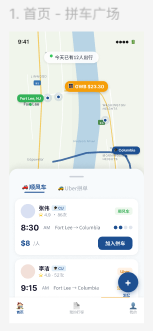
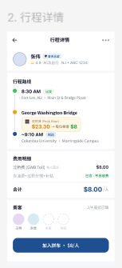
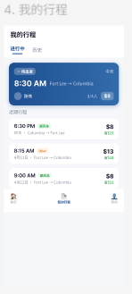
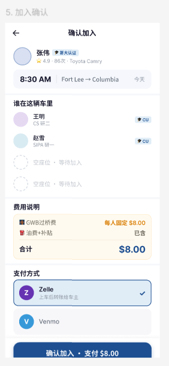

# 🚗 Columbia Carpool Miniapp

<div align="center">

[](https://github.com/KaichenCurry/columbia-carpool-miniapp/stargazers)
[](LICENSE)
[](https://developers.weixin.qq.com/miniprogram/dev/index.html)
[](#current-status)

**面向哥大留学生的拼车小程序 — Fort Lee ↔ Columbia University**

[English](./README_en.md) · [产品文档](./docs) · [设计稿](./docs_FIGMA.md)

</div>

---

## 🎯 是什么

面向 **哥伦比亚大学留学生** 的微信拼车小程序，解决 **Fort Lee ↔ Columbia** 通勤痛点。

| 痛点 | 解决方案 |
|------|---------|
| 过乔治华盛顿大桥费用高 | 多人分摊 GWB 过桥费 |
| 微信群协调效率低 | 标准化拼车流程 |
| 第一次拼车信任难建立 | 哥大认证体系 |

**两种拼车模式**：
- 🚗 **顺风车**：车主发布行程，乘客加入
- 🚕 **Uber 拼单**：乘客拼单打车，分摊车费

---

## 📱 功能预览

### 1. 首页 - 拼车广场



浏览所有可加入的行程：
- 地图显示 Fort Lee ↔ Columbia 路线
- 实时显示今日拼车人数
- 顺风车 / Uber 拼单切换
- 行程卡片：车主信息、时间、价格、剩余座位

---

### 2. 行程详情



查看完整行程信息：
- 车主认证信息 + 评分
- 路线时间轴（Fort Lee → GW Bridge → Columbia）
- 费用明细：GWB $8/人（含过桥费）
- 乘客列表：查看谁在这辆车上
- 一键加入拼车

---

### 3. 发起拼车


发布自己的行程：
- 切换顺风车 / Uber 拼单模式
- 选择出发地、目的地
- 设置出发时间
- 选择可乘人数
- 自动计算过桥费分摊

---

### 4. 我的行程



管理已加入的行程：
- 进行中：待出发 / 正在进行的行程
- 历史：已完成的行程记录
- 查看行程详情、乘客状态

---

### 5. 确认加入



确认并支付：
- 查看车主和乘客信息
- 确认费用明细（GWB $8）
- 选择支付方式（Zelle / Venmo）
- 确认加入 · 支付 $8.00

---

## ✨ 核心功能

### 产品流程

```
浏览行程 → 查看详情 → 加入拼车 → 确认支付 → 我的行程
```

### 信任体系

| 功能 | 说明 |
|------|------|
| 哥大认证 | 车主必须通过哥伦比亚大学身份认证 |
| 评分系统 | 5 星评分 + 行程次数展示 |
| 实名信息 | 乘客可查看车主真实姓名和车辆信息 |

### 费用透明

| 项目 | 说明 |
|------|------|
| GWB 过桥费 | 固定 $8/人（高峰时段 $23.30 均摊） |
| 油费补贴 | 已包含在固定费用中 |
| 无隐藏费用 | 明确标注"不再额外收费" |

---

## 🛠️ 技术架构

```
┌─────────────────────────────────────────────────────────────┐
│                     微信小程序前端                            │
│  miniprogram/pages/*    components/*    services/*          │
└─────────────────────────────────────────────────────────────┘
                              │
                              ▼
┌─────────────────────────────────────────────────────────────┐
│                    微信云开发云函数                          │
│  cloudfunctions/*                                        │
│  ├── createTrip        创建行程                            │
│  ├── joinTrip          加入行程                            │
│  ├── getTrips          获取行程列表                        │
│  ├── getTripDetail     行程详情                            │
│  ├── getMyTrips        我的行程                            │
│  ├── verifyCU          哥大认证                            │
│  └── getCreateTripHint AI 出发时间建议                     │
└─────────────────────────────────────────────────────────────┘
                              │
                              ▼
┌─────────────────────────────────────────────────────────────┐
│                    微信云开发数据库                         │
│  users          trips          passengers                  │
└─────────────────────────────────────────────────────────────┘
```

### 项目结构

```
columbia-carpool-miniapp/
├── miniprogram/                 # 小程序前端
│   ├── pages/
│   │   ├── index/              # 首页（拼车广场）
│   │   ├── trip-detail/        # 行程详情
│   │   ├── create-trip/        # 发起拼车
│   │   ├── my-trips/           # 我的行程
│   │   └── confirm-join/       # 确认加入
│   ├── components/             # 复用组件
│   ├── services/               # API 服务层
│   └── app.js                  # 应用入口
│
├── cloudfunctions/              # 云函数
│   ├── createTrip/
│   ├── joinTrip/
│   ├── getTrips/
│   ├── getTripDetail/
│   ├── getMyTrips/
│   ├── verifyCU/
│   └── getCreateTripHint/      # AI 出发时间建议
│
└── docs/
    ├── screenshots/            # 功能截图
    ├── Figma 设计稿链接
    └── 产品需求文档
```

---

## 🤖 AI 功能（已上线）

### 智能出发时间建议

在发起拼车时，系统会根据历史数据给出建议出发时间：

```
{
  "departureTime": "8:30 AM",
  "confidence": "高",
  "reason": "根据历史数据分析，8:30 AM 出发可避开早高峰，准时到达",
  "strategy": "heuristic_v1"
}
```

**功能特点**：
- 一键应用建议时间到表单
- 支持切换路线/模式时自动刷新
- 可解释的建议理由

---

## 📊 当前状态

### 已实现

- ✅ 5 页完整小程序界面
- ✅ 拼车创建和加入流程
- ✅ 行程详情和我的行程
- ✅ 云函数完整骨架
- ✅ 本地 Mock 数据支持调试
- ✅ 哥大认证体系
- ✅ 智能出发时间建议

### 局限性

- ⚠️ 部分选择器使用占位交互
- ⚠️ 支付结算未集成
- ⚠️ 实时行程追踪未实现
- ⚠️ AI 为启发式，非模型驱动

---

## 🚀 快速开始

### 环境要求

- 微信开发者工具
- 微信云开发环境

### 运行步骤

```bash
# 1. 克隆项目
git clone https://github.com/KaichenCurry/columbia-carpool-miniapp.git
cd columbia-carpool-miniapp

# 2. 用微信开发者工具打开
# 导入项目，选择 project.config.json

# 3. 配置云开发环境
# 在 miniprogram/app.js 中设置云环境 ID

# 4. 创建云数据库集合
# 导入 cloudfunctions/seeds/ 中的种子数据
```

### 种子数据

```bash
cloudfunctions/seeds/
├── users.seed.json   # 用户数据
└── trips.seed.json   # 行程数据
```

---

## 🗺️ 未来路线图

| 时间 | 功能 |
|------|------|
| v1.1 | 自然语言创建行程 |
| v1.2 | 智能路线推荐（基于历史模式） |
| v1.3 | 高峰期需求预测 |
| v2.0 | GWB 实时路况提醒 |
| v2.0 | 异常取消检测 |

---

## 🔗 链接

| 资源 | 链接 |
|------|------|
| GitHub | https://github.com/KaichenCurry/columbia-carpool-miniapp |
| Figma 设计稿 | [首页](https://www.figma.com/design/NHrWvqG4BzihpYZu9Y0Ugg/拼车-UI?node-id=6-2) |
| 产品文档 | [docs/](docs) |

---

## 📜 License

[MIT License](./LICENSE)

---

<div align="center">

**给个 ⭐ 支持一下！**

*Made by [Curry Chen](https://github.com/KaichenCurry)*

</div>
