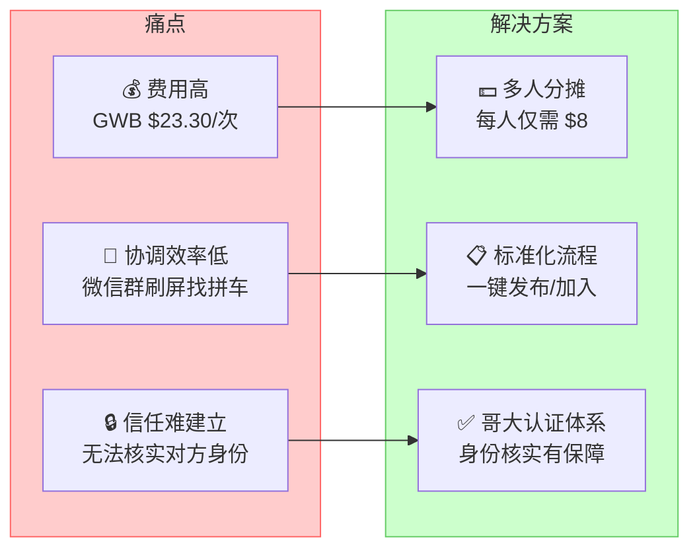
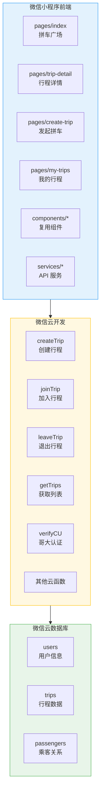
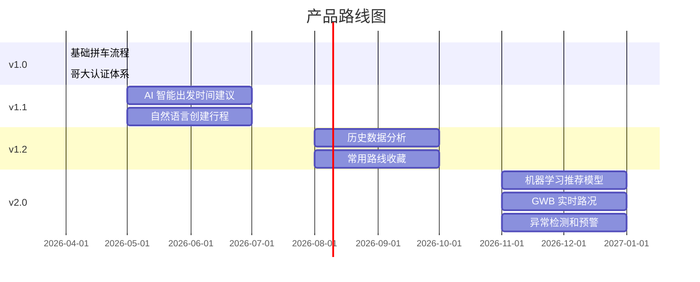

# 🚗 Columbia Carpool Miniapp

<div align="center">

[](https://github.com/KaichenCurry/columbia-carpool-miniapp/stargazers)
[](LICENSE)
[](https://developers.weixin.qq.com/miniprogram/dev/index.html)

**面向哥大留学生的拼车小程序 — Fort Lee ↔ Columbia University**

[English](./README_en.md) · [产品需求文档](./docs/PRD.md) · [设计稿](./docs_FIGMA.md)

</div>

---

## 📋 目录

- [项目介绍](#项目介绍)
- [问题与解决方案](#问题与解决方案)
- [功能预览](#功能预览)
- [核心功能](#核心功能)
- [技术架构](#技术架构)
- [快速开始](#快速开始)
- [项目结构](#项目结构)
- [未来路线图](#未来路线图)
- [相关文档](#相关文档)

---

## 项目介绍

### 是什么

面向 **哥伦比亚大学留学生** 的微信拼车小程序，解决 **Fort Lee, NJ ↔ Columbia University** 日常通勤需求。

### 核心场景

> 哥大学生住在 Fort Lee，每日通勤经过 **乔治·华盛顿大桥（GWB）**，单程过桥费 **$23.30**。通过拼车，每位乘客仅需支付 **$8**，车主覆盖成本，乘客省钱。

### 两种拼车模式

| 模式 | 说明 | 费用 |
|------|------|------|
| 🚗 顺风车 | 车主发布行程，乘客加入 | $8/人 |
| 🚕 Uber 拼单 | 乘客组队叫 Uber，AA 分摊 | 实时计价 |

---

## 问题与解决方案

### 三大痛点



---

## 功能预览

### 用户操作流程


**Step 1：首页 — 拼车广场**
浏览可用行程，查看地图和今日拼车人数。

**Step 2：行程详情**
查看车主信息、路线时间轴、费用明细，确认后加入。

**Step 3：发起拼车**
填写行程信息，设置时间、人数，发布自己的拼车。

**Step 4：我的行程**
管理已加入的行程，查看进行中/历史的订单。

**Step 5：确认加入**
选择支付方式（Zelle/Venmo），完成拼车加入。

---

## 核心功能

### 信任体系

| 功能 | 说明 | 状态 |
|------|------|------|
| 哥大认证 | 绑定 Columbia 邮箱或学生 ID | ✅ |
| 车主评分 | 5 星评分系统 | ✅ |
| 实名车辆 | 车牌号、车型信息 | ✅ |
| 历史行程 | 显示车主接单次数 | ✅ |

### 费用透明

| 项目 | 金额 | 说明 |
|------|------|------|
| GWB 过桥费 | **$8/人** | 固定价格 |
| 油费补贴 | 已包含 | 不额外收费 |
| 隐藏费用 | 无 | 明确标注 |

---

## 技术架构

### 系统架构



---

## 快速开始

### 环境要求

| 环境 | 版本要求 |
|------|---------|
| 微信开发者工具 | 最新版本 |
| 微信 | 8.0+ |

### 部署步骤

```bash
# 1. 克隆项目
git clone https://github.com/KaichenCurry/columbia-carpool-miniapp.git
cd columbia-carpool-miniapp

# 2. 导入项目
# 打开微信开发者工具，选择「导入项目」

# 3. 配置云环境
# 在 miniprogram/app.js 中修改云环境 ID

# 4. 创建云数据库集合
# users, trips, passengers
```

---

## 项目结构

```
columbia-carpool-miniapp/
├── miniprogram/                    # 小程序前端
│   ├── pages/
│   │   ├── index/               # 首页（拼车广场）
│   │   ├── trip-detail/          # 行程详情
│   │   ├── create-trip/          # 发起拼车
│   │   ├── my-trips/             # 我的行程
│   │   └── join-confirm/         # 确认加入
│   ├── components/                # 复用组件
│   ├── services/                  # API 服务层
│   └── app.js                    # 应用入口
│
├── cloudfunctions/                # 云函数
│   ├── createTrip/               # 创建行程
│   ├── joinTrip/               # 加入行程
│   ├── getTrips/               # 获取行程列表
│   ├── verifyCU/               # 哥大认证
│   └── ...
│
└── docs/
    ├── screenshots/             # 功能截图
    ├── PRD.md                  # 产品需求文档
    └── docs_FIGMA.md          # 设计稿说明
```

---

## 项目状态

### ✅ 已实现

| 功能 | 状态 |
|------|------|
| 5 页小程序界面 | ✅ |
| 拼车创建和加入流程 | ✅ |
| 哥大认证体系 | ✅ |
| Mock 数据调试 | ✅ |

### ⚠️ 规划中

| 功能 | 状态 |
|------|------|
| AI 智能出发时间建议 | ⚠️ v1.1 |
| 完整支付集成 | ⚠️ 规划中 |
| 实时位置追踪 | ⚠️ 规划中 |

---

## 未来路线图



---

## 相关文档

| 文档 | 说明 |
|------|------|
| [PRD.md](./docs/PRD.md) | 产品需求文档 |
| [docs_FIGMA.md](./docs_FIGMA.md) | 设计稿说明 |
| [UI_COMPONENTS.md](./UI_COMPONENTS.md) | UI 组件规范 |

---

## 参与贡献

欢迎提交 Issue 和 Pull Request！

---

## License

[MIT License](./LICENSE)

---

<div align="center">

**如果这个项目对你有帮助，请给它一个 ⭐！**

*Made by [Curry Chen](https://github.com/KaichenCurry)*

</div>
