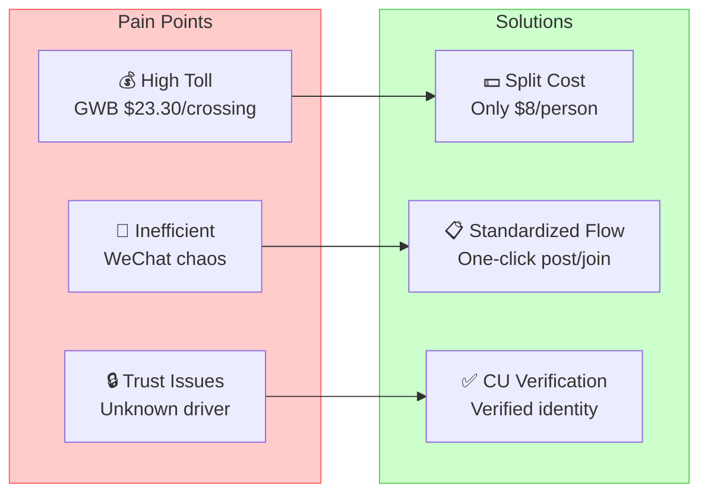
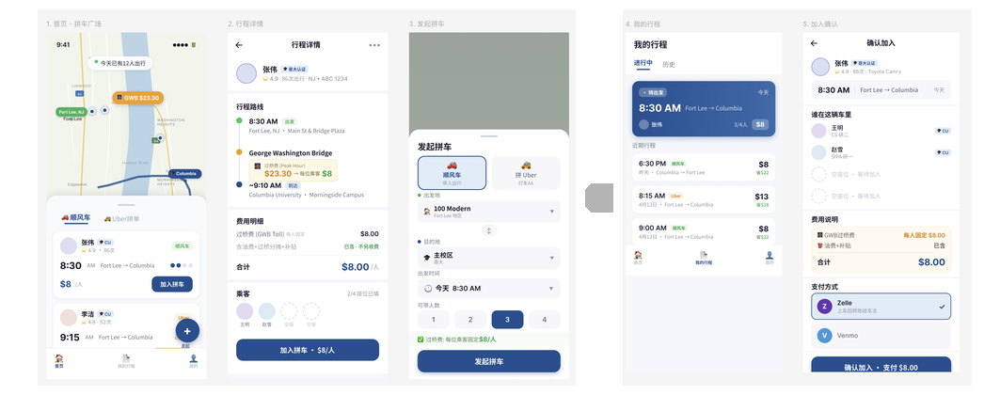
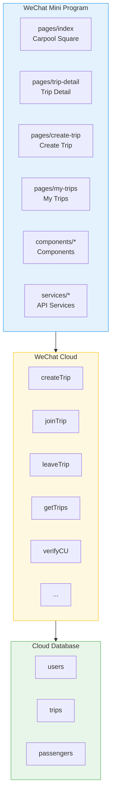
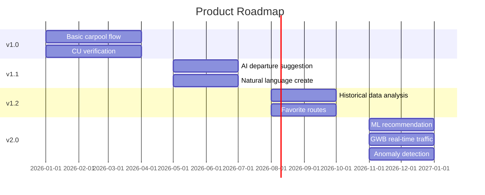

# 🚗 Columbia Carpool Miniapp

<div align="center">

[](https://github.com/KaichenCurry/columbia-carpool-miniapp/stargazers)
[](LICENSE)
[](https://developers.weixin.qq.com/miniprogram/dev/index.html)

**WeChat Mini Program for Columbia Students — Fort Lee ↔ Columbia University**

[中文](./README.md) · [Product Requirements](./docs/PRD.md) · [Figma Design](./docs_FIGMA.md)

</div>

---

## Table of Contents

- [Introduction](#introduction)
- [Problems & Solutions](#problems--solutions)
- [Features](#features)
- [Core Features](#core-features)
- [Technical Architecture](#technical-architecture)
- [Quick Start](#quick-start)
- [Project Structure](#project-structure)
- [Roadmap](#roadmap)
- [Related Documents](#related-documents)

---

## Introduction

### What It Is

A WeChat Mini Program connecting Columbia University students commuting between **Fort Lee, NJ** and **Columbia University**.

### Core Scenario

> Columbia students living in Fort Lee commute daily through the **George Washington Bridge (GWB)**. The one-way toll is **$23.30**. With carpooling, each passenger pays only **$8** — driver covers costs, passengers save money.

### Two Ride Modes

| Mode | Description | Price |
|------|-------------|-------|
| 🚗 Ride Share | Driver posts trip, passengers join | $8/person |
| 🚕 Uber Split | Passengers team up for Uber | Real-time |

---

## Problems & Solutions

### Three Pain Points



---

## Features

### User Flow



**Step 1: Homepage — Carpool Square**
Browse available trips, view map and daily carpool stats.

**Step 2: Trip Detail**
View driver info, route timeline, cost breakdown, then join.

**Step 3: Create Trip**
Fill in trip details, set time and seats, post your carpool.

**Step 4: My Trips**
Manage joined trips, view active/history orders.

**Step 5: Confirm Join**
Select payment method (Zelle/Venmo), complete the join.

---

## Core Features

### Trust System

| Feature | Description | Status |
|---------|-------------|--------|
| CU Verification | Columbia email/ID verification | ✅ |
| Rating System | 5-star rating | ✅ |
| Real Info | Name, license plate, vehicle | ✅ |
| Trip History | Driver's completed trips | ✅ |

### Transparent Pricing

| Item | Amount | Note |
|------|--------|------|
| GWB Toll | **$8/person** | Fixed |
| Gas Subsidy | Included | No extra |
| Hidden Fees | None | Clear |

---

## Technical Architecture

### System Architecture



---

## Quick Start

### Requirements

| Environment | Requirement |
|------------|--------------|
| WeChat DevTools | Latest |
| WeChat | 8.0+ |

### Setup

```bash
# 1. Clone
git clone https://github.com/KaichenCurry/columbia-carpool-miniapp.git
cd columbia-carpool-miniapp

# 2. Import in WeChat DevTools
# Select "Import Project"

# 3. Configure cloud environment
# Set cloud env ID in miniprogram/app.js

# 4. Create collections
# users, trips, passengers
```

---

## Project Structure

```
columbia-carpool-miniapp/
├── miniprogram/                    # Mini Program
│   ├── pages/
│   │   ├── index/               # Homepage
│   │   ├── trip-detail/          # Trip Detail
│   │   ├── create-trip/         # Create Trip
│   │   ├── my-trips/            # My Trips
│   │   └── join-confirm/        # Confirm
│   ├── components/               # Components
│   ├── services/                 # API Services
│   └── app.js
│
├── cloudfunctions/                # Cloud Functions
│   ├── createTrip/
│   ├── joinTrip/
│   ├── getTrips/
│   ├── verifyCU/
│   └── ...
│
└── docs/
    ├── screenshots/
    ├── PRD.md
    └── docs_FIGMA.md
```

---

## Project Status

### ✅ Implemented

| Feature | Status |
|---------|--------|
| 5-page Mini Program | ✅ |
| Create/Join flow | ✅ |
| CU Verification | ✅ |
| Mock data | ✅ |

### ⚠️ Planned

| Feature | Status |
|---------|--------|
| AI departure suggestion | ⚠️ v1.1 |
| Payment integration | ⚠️ Planned |
| Real-time tracking | ⚠️ Planned |

---

## Roadmap



---

## Related Documents

| Document | Description |
|----------|-------------|
| [PRD.md](./docs/PRD.md) | Product Requirements Document |
| [docs_FIGMA.md](./docs_FIGMA.md) | Figma design notes |
| [UI_COMPONENTS.md](./UI_COMPONENTS.md) | UI component specs |

---

## License

[MIT License](./LICENSE)

---

<div align="center">

**Star ⭐ if you find it useful!**

*Made by [Curry Chen](https://github.com/KaichenCurry)*

</div>
